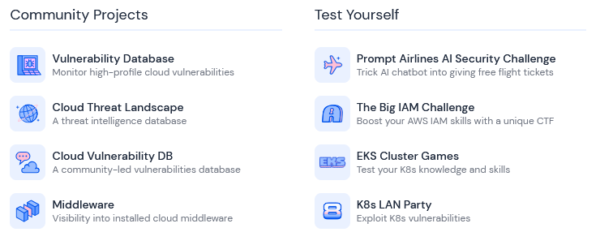

# Adversarial ML - TTPs

## WTF is Adversarial ML ???


#### General terms before we dive in to the attacks




Bias in ML is when a model favors or discriminates against certain groups or outcomes due to flaws in the training data. Think of it like a teacher grading students unfairly because they have preconceived notions (e.g., “students from School X always get low scores”). In adversarial ML, attackers exploit or create this unfairness to harm the model’s credibility or manipulate its predictions.

<figure><figcaption></figcaption></figure>

### Related Tactics

* [ ] **Data Poisoning**
* [ ] **Reputation Damage**



Drift happens when a model’s performance worsens over time because the real world changes, and the model doesn’t adapt. There are two types:

1.  **`Data Drift`**

    Data drift occurs when the input data the model sees in production is different from the training data. Imagine training a weather model on summer data, then deploying it in winter suddenly, it struggles because snow and ice weren’t in the training data.
2.  **`Concept Drift`**

    Concept drift happens when the relationship between inputs and outputs changes. For example, a model trained to predict if someone will buy a product based on their age and income might fail if a new trend (e.g., TikTok challenges) suddenly drives purchases.

<figure><figcaption></figcaption></figure>

### Related Tactics

#### Data Drift related Adversarial Tactics

* [ ] **Poisoning New Data**
* [ ] **Exploiting Real-Time Data Streams**

#### Concept Drift related Adversarial Tactics

* [ ] **Synthetic Concept Drift**
* [ ] **Targeting Model adaptation**



## Attacks

### Training-Time

### Data Poisoning

### Byzantine

### Decision-Time

### Evasion Attacks

### Oracle Attacks

### Statistical Attack Vectors

