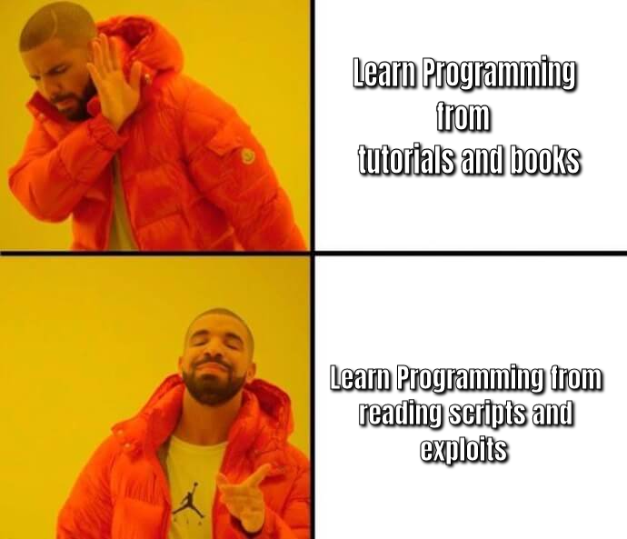
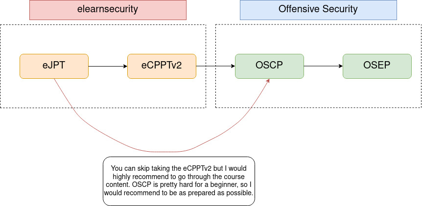
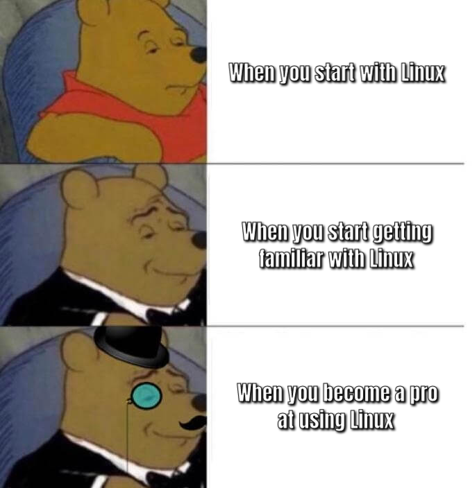

# Ingress


If you're reading this and don't understand a term or an acronym try your best to google it, coz there **will** be a lot of googling when you get into security.


Everyone asks for prerequisites when starting in Security, so let's get to it first.

### Do I need to know programming/coding?

No matter how much you avoid it you'll end up writing scripts, it may either be modifying existing scripting tools or making your own. But as you are just starting out you won't be doing it that much at the beginning.

But the ability to read code will be very helpful at the start, you should also be able to adapt to different programming languages. The major ones I would recommend you to look over would be `Python, Ruby, Bash, C/C++` , in no way I mean to become an expert in these languages before you start, but have a basic understanding of how they work. The amount of code you'll be looking at for exploits and vulnerabilities while pentesting, you'll pretty much learn it from there. If you're willing to learn from tutorials any YouTube channel that you can understand the best is more than enough because they all explain most of the same things but in different ways.

### Do I need to use Kali Linux? Can I use Windows?

To be frank, any Linux Distro will do the job, Kali gets all the tools required for pentesting pre-installed which makes it a bit easier. For starters try Ubuntu and get familiar with it.

You can use windows for pentesting, but it's hard to use some tools so I would recommend either using WSL\(Windows Subsystem for Linux\) or a VM\(Virtual machine\). If you're feeling adventurous you can dual-boot your system but I highly recommend not to do it without someone to help you with it.

As for me, I use Kali Linux as my main machine which is a pretty dumb move from my side but I invested too much time in it now to switch.

### **Do I need to learn Computer Networking?**

You need to know the basics of it and most terms and what they mean. You can try and learn it from different books or try to learn it from pentesting writeups.

For books, I would recommend [Comptia Network+](http://te.ugm.ac.id/~widyawan/files/Network+.pdf) but it gets a bit boring without any practical application, so I would recommend learning it through pentesting. When I say pentesting I don't mean real-world pentesting but in solving machines and challenges in practice sites.


[What is a CTF?](https://ctfd.io/whats-a-ctf/)


### What does hacking contain? Is it just "I'm in" as the movies say?

Hacking is much more than "I'm in" but sometimes it boils down to it 😋 . It's a really vast field with different topics and these topics are inter-connected with each other in more than one ways, So its pretty hard to isolate each topic and learn it as they almost always go hand-in-hand. You can read about the major topics you would find in CTF's and pentests below.



#### Cryptography

I don't think I need to explain this, it's encrypting stuff but oh boy believe me when I say it's pretty hard and interesting. There's a ton of things you can actually encrypt not just text and in so many different and amazing ways.

I couldn't find a good site fully dedicated to this but [CyberChef](https://gchq.github.io/CyberChef/) is a good site for cryptography in CTF's.

The math maybe a bit scary at first but the understanding of basic principles used to implement it will help you crack it.



#### Reverse Engineering

This is about converting compiled/machine code back to a more human readable format to understand the functionality of a given program and if possible find ways to exploit it.

It mostly includes Assembly/Machine code, compiled C programs. There are specific tools you use to achieve this don't worry you don't have to do it manually. These tools will help you in a lot more other things than just Reverse Engineering.

[RevEng101](https://malwareunicorn.org/workshops/re101.html#0) is a site by [MalwareUnicorn](https://twitter.com/malwareunicorn) explore other parts of her site too for more Reverse Engineering stuff.



#### Forensics

It is recovering the digital trail left on a computer for finding clues of a footprint left by a malicious hacker or someone who tried to seemingly delete data or send it somewhere else.

It includes file format analysis, steganography, memory dump analysis, or network packet capture analysis. It's not exactly hacking but chasing after the hacker or searching for clues to hack something.

There's not much of a good site I would recommend dedicated for this, explore different challenges and problems in CTF's to understand the wide range covered in this.



#### OSINT \(Open Source INTelligence\)

OSINT refers to gathering data and information through publicly available sources\(like googling, yup that is also considered as OSINT\). Don't underestimate it just because it is gathering information, a lot of companies and people tend to leave a lot of information publicly than they think and information is power in hacking.

It is pretty important while conducting a real world pentest to properly plan out attack strategies and also in CTF's.

[Trace Labs](https://www.tracelabs.org/) is a site dedicated to helping people in real life using OSINT.



#### Web Exploitation

It is exactly what is sounds like, exploiting websites or application on the internet. These are pretty common in real world and have bug bounty programs hosted to find vulnerabilities.

[Web Security Academy](https://portswigger.net/web-security) is a site fully dedicated to learning Web Exploitation.

Some pretty big bug bounty programs

* [Bugcrowd](https://www.bugcrowd.com/)
* [HackerOne](https://www.hackerone.com/)
* [Intigriti](https://www.intigriti.com/)
* [Synack](https://www.synack.com/) \(This one is private but covers more more than just web\)

Some companies have their own private bug bounty programs on their sites, you can check them out directly too.



#### Binary Exploitation

This is a pretty broad topic which in short can be explained as finding a vulnerability in a program and exploiting it. It includes Buffer overflows, Heap exploitation, Stack smashing and a lot more. It is to have full control of how a program/system works in short pwning\(owning\) it.

[pwnable.kr](http://pwnable.kr/) is a site fully dedicated to this.

**Interesting Fact** : It is called pwning instead of owning because of a typo made by a game developer in WarCraft and it stuck.



I didn't mention Hardware, Mobile and IoT, coz I didn't do much of anything over there.

#### Pentesting 

It's short for Penetration Testing. It includes more or less of everything mentioned above and a little bit more. It doesn't fully focus on one single topic, different machines and labs choose to focus on different kinds of vulnerabilities and exploits of different software's and systems.

### Now for where to actually practice

* [OverTheWire](https://overthewire.org/wargames/)

  You can learn a lot of basic to intermediate stuff here from Linux to Web Application Security

* [TryHackMe](https://tryhackme.com)

  This is the most beginner-friendly site, it has a lot of resources to learn from and experiment on legally.

* [picoCTF](https://picoctf.org/)

  This contains archives of previous picoCTF's, you can practice them it's very helpful when trying to test your basic knowledge. They also hold yearly CTF's in Feb-Mar.

* [CodeWars](https://www.codewars.com)

  This is not exactly a site for hacking but you can practice your scripting skills in different languages, it also contains some cryptography challenges.

* [HackTheBox](https://app.hackthebox.eu)

  This one's a pretty hardcore site, I would highly suggest beginners steer clear of this site until you think you're at least an intermediate level.

* [OSPG](https://portal.offensive-security.com)

  This one is purely penetration testing and has very good and interesting machines.

* [CTFtime](https://ctftime.org/)

  This website is not exactly a site for practice but keeps track of all ongoing live CTF's so that you can participate them at your convenience.

When practicing in any of the above sites do not hesitate to look at solutions because you're in the learning phase, you don't know a lot of stuff in the beginning, learn from the solutions and note them down.

### How to keep up in the security world

Twitter, Reddit, and YouTube play a huge role in keeping up with everything going on currently in the community. LinkedIn is a bit stagnant but it's pretty helpful in following what the security companies are doing.

Keeping up in this community is pretty vital so make sure you're up-to-date with whatever is going on.

Here are some profiles you can follow to start off you can find other good ones through their retweets and mentions.



* [John Hammond](https://www.youtube.com/channel/UCVeW9qkBjo3zosnqUbG7CFw)
* [LiveOverflow](https://www.youtube.com/channel/UClcE-kVhqyiHCcjYwcpfj9w)
* [InsiderPhd](https://www.youtube.com/channel/UCPiN9NPjIer8Do9gUFxKv7A)
* [Stok Frederik](https://www.youtube.com/channel/UCQN2DsjnYH60SFBIA6IkNwg)
* [HackerSploit](https://www.youtube.com/channel/UC0ZTPkdxlAKf-V33tqXwi3Q)
* [ippsec](https://www.youtube.com/channel/UCa6eh7gCkpPo5XXUDfygQQA)
* [Nahamsec](https://www.youtube.com/channel/UCCZDt7MuC3Hzs6IH4xODLBw)
* [DEFCONconference](https://www.youtube.com/channel/UC6Om9kAkl32dWlDSNlDS9Iw)
* [The Linux Foundation](https://www.youtube.com/channel/UCfX55Sx5hEFjoC3cNs6mCUQ)



* [Pawan Sohlot](https://twitter.com/PawanSohlot)
* [CybersecMeg](https://twitter.com/cybersecmeg)
* [PwnFunction](https://twitter.com/PwnFunction)
* [Kevin Beaumont](https://twitter.com/GossiTheDog)
* [oooverflow](https://twitter.com/oooverflow)
* [TheCyberMentor](https://twitter.com/thecybermentor)



* [CloudSEK](https://www.linkedin.com/company/cloudsek/)
* [Intigriti](https://www.linkedin.com/company/intigriti/)
* [FireEye](https://www.linkedin.com/company/fireeye/)
* [OWASP Foundation](https://www.linkedin.com/company/owasp/)
* [Offensive Security](https://www.linkedin.com/company/offensive-security/)
* [Synack](https://www.linkedin.com/company/synack-inc-/)
* [CrowdStrike](https://www.linkedin.com/company/crowdstrike/)



* [r/netsec](https://www.reddit.com/r/netsec/)
* [r/cybersecurity](https://www.reddit.com/r/cybersecurity/)
* [r/hacking](https://www.reddit.com/r/hacking/)
* [r/bugbounty](https://www.reddit.com/r/bugbounty/)
* [r/oscp](https://www.reddit.com/r/oscp/)
* [r/securityCTF](https://www.reddit.com/r/securityCTF/)
* [r/Defcon](https://www.reddit.com/r/Defcon/)



I tried not to repeat people from YouTube on Twitter so that I can mention more people. Do follow their YouTube, Twitter, and LinkedIn, coz remember this always **`More Information is always Good`**.

### Courses, Certifications and Exams

A lot of Certification exams you apply for come bundled with a course. There aren't many good courses out there either most of them either feel like scams or are scams.

The courses I would recommend are pretty less, rather than courses I would recommend to read blogs and articles, GitHub repos will be a real huge help if you're looking for some course like modeled content.

Here are some good GitHub repos and courses I followed/took.



* From TheCyberMentor
  * [Practical Ethical Hacking](https://academy.tcm-sec.com/p/practical-ethical-hacking-the-complete-course)
* From Tib3rius \(do not take as a complete beginner\)
  * [Windows Privilege Escalation](https://www.udemy.com/course/windows-privilege-escalation/)
  * [Linux Privilege Escalation](https://www.udemy.com/course/linux-privilege-escalation/)



* [Bugcrowd University](https://github.com/bugcrowd/bugcrowd_university)
* [Nahamsec Resources](https://github.com/nahamsec/Resources-for-Beginner-Bug-Bounty-Hunters)
* [TrailofBits](https://github.com/trailofbits/ctf)
* [Awesome-pentest](https://github.com/enaqx/awesome-pentest)




Do not just watch the courses or only study from guides, use it practically on the practice sites simultaneously as you're learning them.


Security certifications are really expensive so you have to be pretty careful and well prepared while taking them. They range from $199 - you can't ever afford them, so be careful when you choose what to get certified for.

The Offensive Security certifications are quite good and are respected in the community,  elearnsecurity ones are really good too. This is how I would recommend you to go through for certifications. 

I highly suggest not to take the OSCP until you've explored at least 2 years in this field.

Use this [OSCP prep guide](https://blog.adithyanak.com/oscp-preparation-guide) if you're preparing for eJPT, eCPPTv2, and OSCP. After OSCP you'll be in this field for enough time to know what to do next.


Do not waste money on certifications that are valid for only 2-3 years or ones with MCQ's. Apply for ones which have a practical exam.


## What I would recommend you to do 

First and foremost I would tell you to read the [Hacker Manifesto](http://phrack.org/issues/7/3.html) and then start the journey.

Before diving in, I would recommend you to get familiar with common terms and tools used through [HackerSploit](https://www.youtube.com/channel/UC0ZTPkdxlAKf-V33tqXwi3Q) and [Hacksplaining](https://www.hacksplaining.com/lessons). Watch some videos of [JohnHammond](https://www.youtube.com/channel/UCVeW9qkBjo3zosnqUbG7CFw) and [LiveOverflow](https://www.youtube.com/channel/UClcE-kVhqyiHCcjYwcpfj9w) and then dive into the practice sites mentioned above.

You'll be navigating through a lot of Linux systems because even though it's not a very widely used desktop OS, 95% of the web use some kind of Linux OS for their servers.

So get yourself as familiar as possible with Linux, it'll be pretty different from windows at the start and a bit annoying and hard to use for someone who never used it but trust me you'll start loving and enjoying it more than windows unless you're a hardcore gamer \(steam is trying to make gaming possible for Linux gonna take some time tho\).

Try to practice daily in TryHackMe because if you lose touch it's gonna be pretty bad in a beginner phase, be as consecutive as possible.

After getting familiar with most of the TryHackMe labs take the [INE starter pass](https://ine.com/) which contains the course content and labs for eJPT for free and when you think you've prepared enough you can take the eJPT exam and get your first certification and then start preparing for OSCP.

After that, I'm pretty sure you would have a pretty strong foothold to decide what to do from that point on.

I made this blog because when I started there were not many people who could have helped me or guided me and I made this in a way such that it answers most of my questions I had when I started.

May the source be with you in this journey, young padawan. **`Hack The Planet`.**

If you would like to ping me for anything, feel free to reach me out on my social media  [LinkedIn](https://www.linkedin.com/in/paul-kadali/), [GitHub](https://github.com/Kaiser784), [Twitter](https://twitter.com/paul_kadali)

